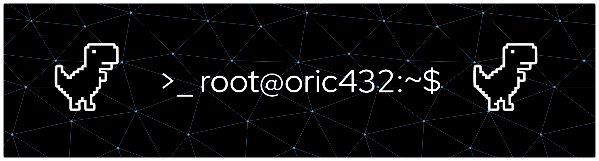

### `>_` about
I build software where correctness isn't optional and performance isn't negotiable — real-time systems, communication protocols, and multimedia pipelines that have to work under CPU, memory, and latency budgets simultaneously.

 

### `>_` languages

&nbsp;&nbsp;
&nbsp;&nbsp;
&nbsp;&nbsp;
&nbsp;&nbsp;
&nbsp;&nbsp;
&nbsp;&nbsp;

### `>_` systems & build tools

&nbsp;&nbsp;
&nbsp;&nbsp;
&nbsp;&nbsp;
&nbsp;&nbsp;
&nbsp;&nbsp;

### `>_` media, networking & backend

&nbsp;
&nbsp;
&nbsp;
&nbsp;
&nbsp;
&nbsp;

**Networking & protocols:** SIP · SDP · RTP/RTCP · TCP/IP · WebRTC · Wireshark
**Systems:** Multithreading · Lock-free patterns · Memory profiling · Real-time scheduling · GDB
**Libraries:** Boost.Asio · Boost.SML · FFmpeg · GStreamer · PortAudio

 

### `>_` stats

 

### `>_` activity

 

